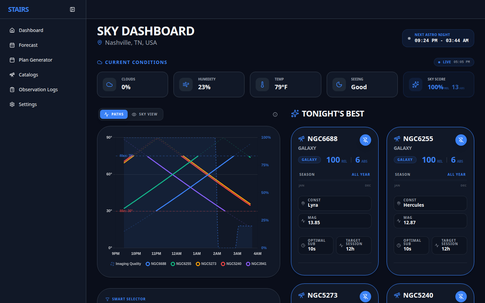
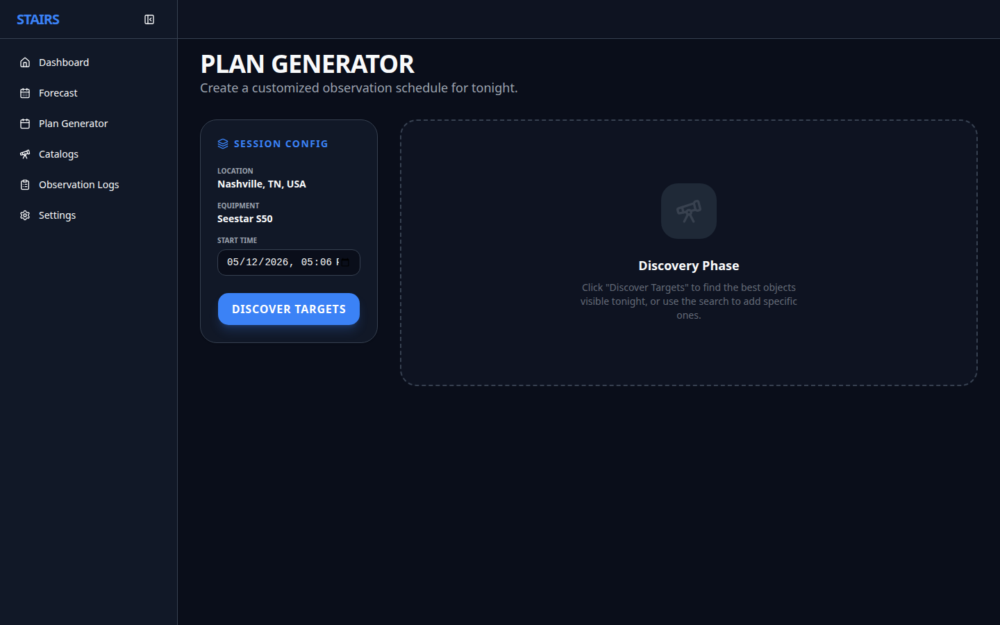
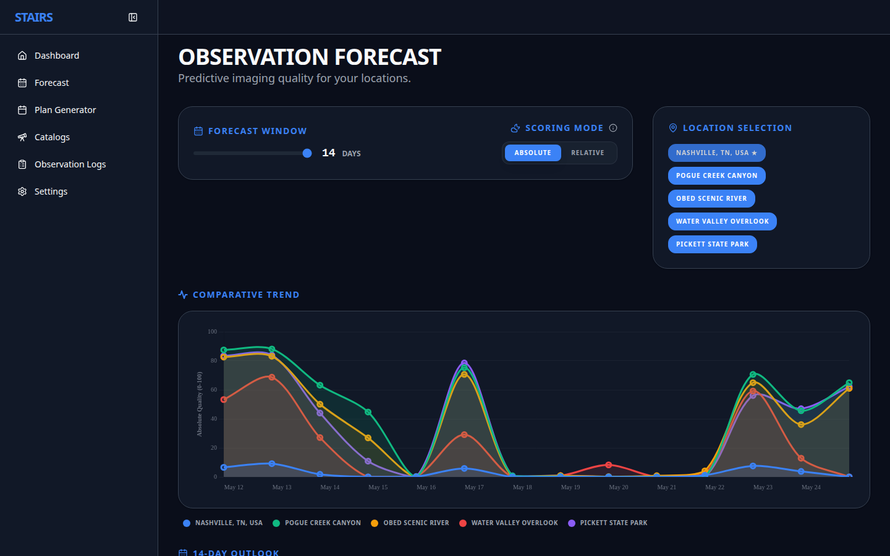

# STAIRS Astro Imaging Run Scheduler v0.3.1 <!-- x-release-please-version -->

STAIRS is a specialized planning tool designed for astrophotography enthusiasts
with smart telescopes (like the [Seestar S50](https://www.seestar.com/products/seestar-s50)) to assist with the planning of imaging sessions. It takes into account telescope specifications, target suitability, sky conditions, and user preferences to score objects.

## Overview

A lot of apps will tell you _what_ is in the sky, but not how to build an efficient imaging plan. STAIRS does both and optimizes for specific equipment.

> [!NOTE]
> If you are looking for instructions on how to run STAIRS via Docker (the recommended method), see [here](#3-running-stairs-via-docker).

## Core Features

- Optimal Window Calculation: Determines the best start/end times for targets based on altitude thresholds and environment.
- Multi-Target Sequencing: Creates a chronological plan to image multiple targets in one session.
- Session Logging: log sessions and document what you have captured
- Multi-Night Forecasting: sky conditions forecasting for multiple nights
- Multi-Location Forecasting: sky conditions forecasting for multiple locations

## Screenshots

<details>
<summary>Click to view application screenshots</summary>

### Web Application


_The Sky Dashboard showing current conditions and recommended targets for Nashville, TN._


_AI-Optimized Plan Generator._


_Multi-site Observation Forecast._

</details>

## Tech Stack

- Backend/API: Python with [astroplan](https://github.com/astropy/astroplan), [Astropy](https://www.astropy.org/), [DuckDB](https://duckdb.org/), [Swagger](https://swagger.io/), and others (see the [pyproject.toml](services/api/pyproject.toml) file for more dependencies)
- Weather Information: provided by [Open-Meteo](https://open-meteo.com)
- CLI: Python with [Typer](https://typer.tiangolo.com/) and others (see the [pyproject.toml](services/cli/pyproject.toml) file for more info)
- Web: React (TypeScript) with [Vite](https://vite.dev/), [Tailwind CSS v4](https://tailwindcss.com/), [Chart.js](https://www.chartjs.org/), and [Lucide Icons](https://lucide.dev/)
- Docker: designed first and foremost to be run via [Docker](https://www.docker.com/) and [Docker Compose](https://docs.docker.com/compose/)

For information on how to contribute and perform a new release, see the [Release Guide](RELEASE_GUIDE.md).

## Getting Started

### Prerequisites

- **Docker and Docker Compose** (Recommended for most users)
- **Python 3.14+** (For local backend development)
- **Node.js 22+** (For local web development)

### Configuration

Before running STAIRS, you must create a configuration file:

1. Clone the repository:
   ```bash
   git clone https://github.com/thomasehardt/STAIRS.git
   cd STAIRS
   ```
2. Create your own configuration file from the example:
   ```bash
   cp .config.yaml.example config.yaml
   ```
3. Edit `config.yaml` and update the information accordingly (the example config is well-documented).

---

## 1. Local Development (As-Is)

Running STAIRS directly on your machine without Docker is useful for development and debugging.

### Backend (API)

1. Navigate to the API directory:
   ```bash
   cd services/api
   ```
2. Create and activate a virtual environment:
   ```bash
   python -m venv .venv
   source .venv/bin/activate  # On Windows: .venv\Scripts\activate
   ```
3. Install dependencies in editable mode:
   ```bash
   pip install -e .
   ```
4. Run the API (from the project root):

   ```bash
   # Return to root
   cd ../..
   export PYTHONPATH=$(pwd)/services/api
   uvicorn src.api.main:app --reload
   ```

   _The API will be available at http://localhost:8000_

   **Tip:** You can override default paths using environment variables:

   - `CONFIG_FILE`: Path to `config.yaml` (default: `config.yaml`)
   - `DATA_DIR`: Path to the `data` directory (default: `data`)
   - `CACHE_DIR`: Path to the `cache` directory (default: `cache`)
   - `LOG_DIR`: Path to the `logs` directory (default: `logs`)

### Web UI

1. Navigate to the web directory:
   ```bash
   cd services/web
   ```
2. Install dependencies:
   ```bash
   npm install
   ```
3. Run the development server:
   ```bash
   npm run dev
   ```
   _The UI will be available at http://localhost:5173_

### CLI

1. Navigate to the CLI directory:
   ```bash
   cd services/cli
   ```
2. Create and activate a virtual environment:
   ```bash
   python -m venv .venv
   source .venv/bin/activate
   ```
3. Install the CLI tool:
   ```bash
   pip install -e .
   ```
4. Use the `stairs` command:
   ```bash
   stairs --help
   ```

---

## 2. Local Docker Development

Running with Docker Compose allows you to spin up the entire stack with a single command, building from your local source code.

### Build and Start

```bash
docker compose up --build
```

- **Production-like UI:** Available at http://localhost:3000
- **Development UI (with HMR):** Available at http://localhost:5173 (via `docker compose up web-dev`)
- **API Docs:** Available at http://localhost:8000/docs

### Running the CLI via Docker

```bash
docker compose run --rm -it cli status
```

_Tip: Create an alias for easier access: `alias stairs-cli="docker compose run --rm -it cli"`_

---

## 3. Running STAIRS via Docker

For production or simple deployment, you can run STAIRS using pre-built images from the GitHub Container Registry.

### Prerequisites

Prior to running STAIRS via Docker, you will need to do the following:

1. create a file named `config.yaml` (use [.config.yaml.example](.config.yaml.example) as a base).
1. create directories (this prevents Docker from creating directories/files as `root`):
   ```bash
   mkdir -p logs cache
   ```

### Using Docker Compose

The repository provides a `docker-compose.prod.yaml` configured to use images from the GitHub Container Registry.

Run with:

```bash
docker compose -f docker-compose.prod.yaml up -d
```

This will start the Web and API layers. You can then use the CLI via the same configuration (see [below](#docker-cli-alias) for aliases).

#### Configuration details in `docker-compose.prod.yaml`:

```yaml
services:
  api:
    image: ghcr.io/thomasehardt/stairs/stairs-api:latest
    container_name: stairs-api
    ports:
      - "8000:8000"
    volumes:
      - ./config.yaml:/app/config.yaml
      - ./data:/app/data:ro
      - ./cache:/app_data/cache
      - ./logs:/app_data/logs
    restart: unless-stopped

   web:
      image: ghcr.io/thomasehardt/stairs/stairs-web:latest
      container_name: stairs-web
      ports:
        - "3000:80"
      environment:
        - VITE_API_URL=http://localhost:8000
      depends_on:
        - api
      restart: unless-stopped

   cli:
      image: ghcr.io/thomasehardt/stairs/stairs-cli:latest
      container_name: stairs-cli
      environment:
        - API_URL=http://api:8000
      depends_on:
        - api

```

Run with:

```bash
docker compose -f docker-compose.prod.yaml up -d
```

To start the Web and API layers (see below for an alias to use the CLI from Docker).

## Usage

Once started, the API layer will initialize a cache to store ephemeris and weather data. If you go to http://localhost:8000, you will be presented with the Swagger API page. This can be used to test and verify the application is working.

Alternatively, you can check the status (among many other things) with the cli:

    docker compose run --rm -it cli status

For help with the cli application, there's a very useful help function:

    docker compose run --rm -it cli --help

<a name="docker-cli-alias"></a>
It is recommended that you create an alias for running the cli ... on Mac/Linux:

    alias stairs-cli="docker compose run --rm -it cli"
