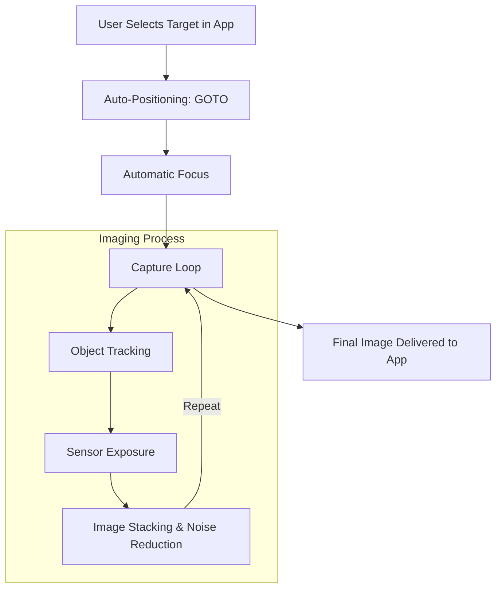

_This guide is part of the [STAIRS Learning Path](index.md). STAIRS (Smart Telescope Astronomical Image Rating System) is a tool used to optimize and score astronomical imaging runs._

## Basics

Let's start with "what is a telescope"? In simplest terms, and for our purposes, we can think of a telescope as a bucket for collecting light. On the open end of the bucket, there is a lens to collect light from a more concentrated area, and light collects at the bottom. With an optical telescope, your eye is the bottom of the bucket.

<figure>
    
    <figcaption><i>fig 1: Seestar S50 and Meade ETX-125EC</i></figcaption>
</figure>

In the most basic sense, a smart telescope is a telescope that takes care of a lot of the manual work of using a telescope. For the usage of STAIRS, this means the telescope has these features:

| Feature                   | What it Means                                                                         | Why it is Important                                                                     |
| ------------------------- | ------------------------------------------------------------------------------------- | --------------------------------------------------------------------------------------- |
| auto-positioning          | The telescope can figure out where it is looking                                      | This is otherwise a manual, often frustrating process                                   |
| automatic focus           | Keeps images as clear as possible                                                     | Prevents blurry images                                                                  |
| object tracking           | Uses motors to follow objects across the night sky                                    | Allows for longer imaging time on a single object                                       |
| light pollution reduction | Uses filters and dark sky normalization to lessen the effect that light pollution has | You don't need perfectly dark skies - you can capture amazing images from your backyard |
| app-based control         | Using an app, you can tell your telescope what to point to and image                  | Makes it simple for anyone to capture images                                            |
| image stacking            | Combines multiple captured images into one                                            | Improves quality of images, meaning you can capture amazing images from almost anywhere |
| portability               | Smart telescopes are generally small and light                                        | Allows you to easily move it to a new location                                          |

## The Parts of a Smart Telescope

### Lenses and Mirrors

There are two ways that telescopes gather light: with lenses or mirrors. A refracting telescope relies primarily on lenses and a reflecting telescope relies primarily on mirrors, though many telescopes use a combination.

#### Lenses

The main purpose of the lens is to let light through while bending it to a focus. A telescope will typically have two main optical components:

objective lens
: This lens (or group of lenses) serves as the entry point of light to the telescope and is responsible for gathering light and bringing it to a focus.

rear optics
: Additional lenses (like reducers or flatteners) responsible for ensuring light gets to the sensor correctly across the entire field of view.

There is one key feature of the objective lens: its diameter (i.e., how wide it is). This is referred to as the _aperture_ and is measured in mm. It determines how much light your telescope can capture. The larger the aperture, the more light you can collect.

<figure>
    
    <figcaption><i>fig 2: refracting telescope optical path</i></figcaption>
</figure>

#### Mirrors

Telescopes using mirrors are typically open on the end. These telescopes still have an _aperture_; it is simply the size of the opening. Like with lens-based telescopes, the _aperture_ determines how much light your telescope can capture.

There are generally two mirrors in a reflecting telescope (though there may be more):

primary mirror
: This mirror reflects the incoming light to a focal point (typically back to the top of the telescope).

secondary mirror
: This mirror intercepts this light and directs it towards the eyepiece or sensor.

<figure>
    
    <figcaption><i>fig 3: reflecting telescope optical path</i></figcaption>
</figure>

### The Sensor

The sensor is the piece of the telescope that ultimately receives the light. In an optical telescope with an eyepiece, that might be your eye, or it might be a camera. In a smart telescope, it is a sort of camera (usually a CMOS Sensor - such as you would find in a smartphone).

The sensor is a grid of millions of tiny light-sensitive squares called pixels. Its job is to collect the light from your lenses or mirrors and turn them into an electronic signal. The sensor keeps collecting light whenever it is active (called the exposure time), so if you leave it open for ten seconds, you will collect more light (and more details) than if you leave it open for one second.

A sensor has two key measurements:

resolution
: The count of individual pixels on the sensor (e.g., $1920 \times 1080$). While higher resolution provides more detail, the total light captured is primarily a function of the sensor's physical size and the telescope's aperture.

pixel size
: How large each pixel (individual "bucket") is (usually measured in micrometers, or $\mu m$). A larger pixel size can capture more light per pixel, whereas a smaller pixel size can capture more detail. A typical pixel size for a smart telescope is $2.9\ \mu m$.

Sensors also have a quantum efficiency, which is how well the sensor can convert a photon hitting it into an electron and collect it.

## Key Telescope Terms in STAIRS

aperture
: Measured in millimeters ($mm$), this is the size of the "opening" of the telescope. It is used to determine how much light the telescope can collect. The Seestar S50 has an aperture of $50\text{mm}$.

exposure time
: How long (measured in seconds) the sensor is collecting light. In classical photography, this is how long the aperture stays open. A longer exposure time will collect more light.

field of view
: The amount of sky (measured in arcminutes) that the telescope can "see". It is a combination of the sensor size and the focal length. For a Seestar S50, this is $43.8\ \times\ 76.8\ \text{arcmin}$, or roughly twice the width of the full moon.

focal length
: The distance (in $mm$) that light travels from the primary lens or primary mirror to the sensor. The longer the focal length, the more magnification, but at the expense of capturing a smaller area of the sky. The Seestar S50 has a focal length of $250\text{mm}$.

focal ratio
: Often referred to as the "f/number", this is the "speed" of your telescope (how much light per second it can capture). The Seestar S50 has a focal ratio of $f/5$.

quantum efficiency
: How efficient (measured in $\%$) a sensor is at converting light into electrons. Another measure of how much light your telescope can collect. For a Seestar S50, this is between $82\%$ and $90\%$.

## How STAIRS Uses Telescope Specifications

### FOV Matching

STAIRS determines how well an object will "fit" into your telescope's sensor, which helps determine target suitability.

### Exposure Optimization

Using many of the above specifications for a telescope, STAIRS can recommend exposure times, both individual exposure times and overall exposure times (when "stacking" images).

## Image Attributions

fig 1
: [Steve Elliott](https://www.flickr.com/people/jabberwock/) ([CC-SA 2.0](https://creativecommons.org/licenses/by-sa/2.0/deed.en))

fig 2
: [Pearson Scott Foresman](https://en.wikipedia.org/wiki/Pearson_Scott_Foresman) ([public domain](https://creativecommons.org/public-domain/))

fig 3
: [Pearson Scott Foresman](https://en.wikipedia.org/wiki/Pearson_Scott_Foresman) ([public domain](https://creativecommons.org/public-domain/))
